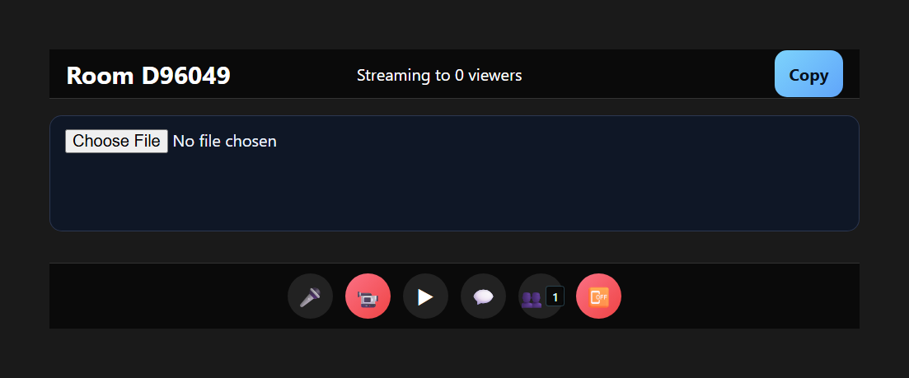

# Implementation Status

This document summarizes what is implemented so far and includes a UI screenshot.

## Snapshot

## Current Features

### Phase 1: Sync Engine + Rooms
- Socket.IO room lifecycle: create, join, leave, host reassignment
- Playback sync and heartbeat drift correction
- Room chat with message broadcast

### Phase 2: WebRTC Host Streaming
- Host streams local video via captureStream to viewers
- Viewer auto-connects to host stream
- ICE signaling relayed by server

### Phase 3: UI Refactor + Media System
- App split into components: LobbyScreen, RoomScreen, VideoPlayer, ControlBar,
  WebcamGrid, ChatPanel, PeoplePanel
- Media hooks: camera/mic toggle, speaking volume meter
- WebRTC webcam/mic peer connections and signaling
- Custom control bar with seek, volume, quality, FPS, fullscreen
- CSS module layout with top bar, webcam strip, bottom toolbar, and side panels

## Notes
- All features build cleanly with Vite
- TURN config is supported via VITE_TURN_* env vars
- Room max viewers: 4 (configurable in server)
